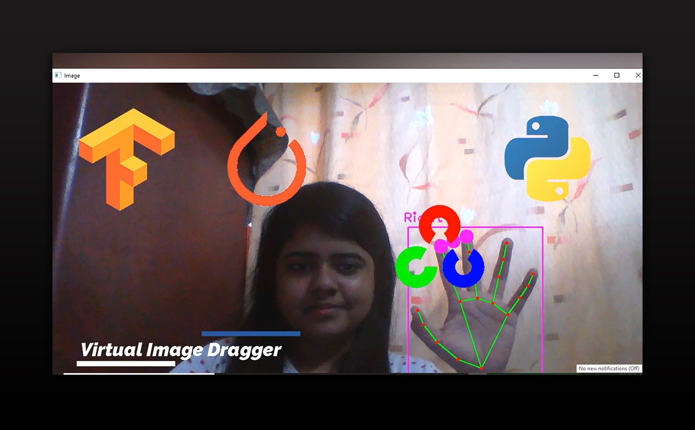
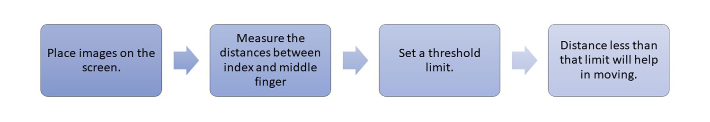

# Virtual_Image_Dragger
*This is a virtual picture dragging application. Users may virtually slide photos across the screen. The distance between the index and middle fingers determines the movement. Smaller distances indicate click and motion, whereas bigger distances indicate only hand movement.*

   

IDEA
------

   

Project Demo https://bit.ly/3yUgFdw :octocat:

Help is taken from CVZone Team.

<b>Give it a STAR if you really appreciate my work</b> &#127775; 

CONNECT WITH ME
---
 

THANK YOU :tada:
--------------------------------

    <meta charset="UTF-8">
    <i> “Make it work, make it right, make it fast.” &#128151 </i>

